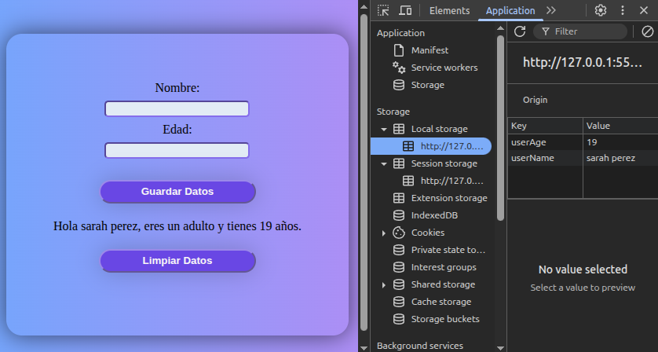

# Manipulación del DOM y Persistencia de Datos
 En este proyecto implemento sobre el DOM (Document Object Model)  y las herramientas de almacenamiento en navegador: Local Storage y Session Storage. Estas habilidades son esenciales para crear aplicaciones web interactivas y dinámicas que retengan información importante entre sesiones o durante la interacción del usuario.
## Funcionabilidades
- Capturar el **nombre** y la **edad** de un usuario desde un formulario.
</img>
- Validar que:
1. El nombre contenga solo letras y espacio (el espacio es si así lo desea el usuario).
2. La edad esté entre 0 a 100 años
- Determina y muestra el rango de edad:
1. Niño (0-13).
2. Adolescente (14-17).
3. Adulto (18-69).
4. Adulto mayor (70-100).
</img>
- Guarda los datos en **Local Storage**.
</img>
- Cuenta cuántas interacciones se han hecho en la sesión usando **Session Storage**.
</img>
---
## Tecnologías utilizadas
- HTML5.
- CSS3.
- JavaScript(ES6).
- Local Storage y Session Storage.
- Manipulación del DOM.
